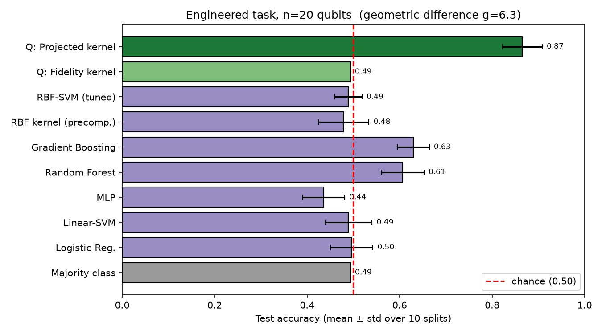
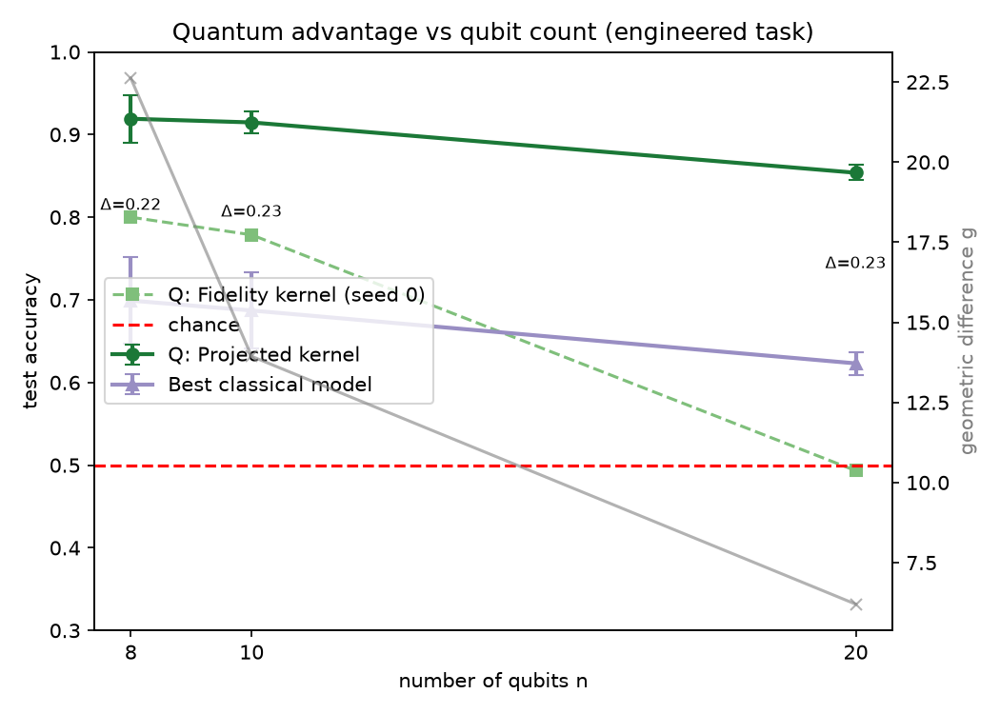
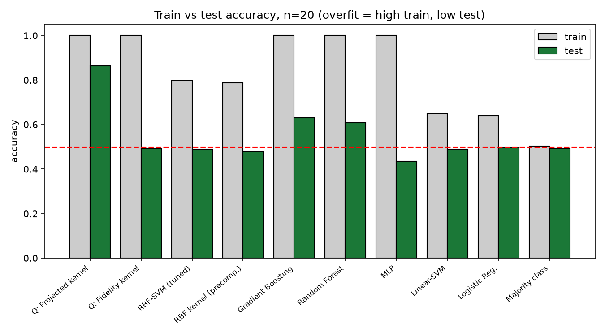
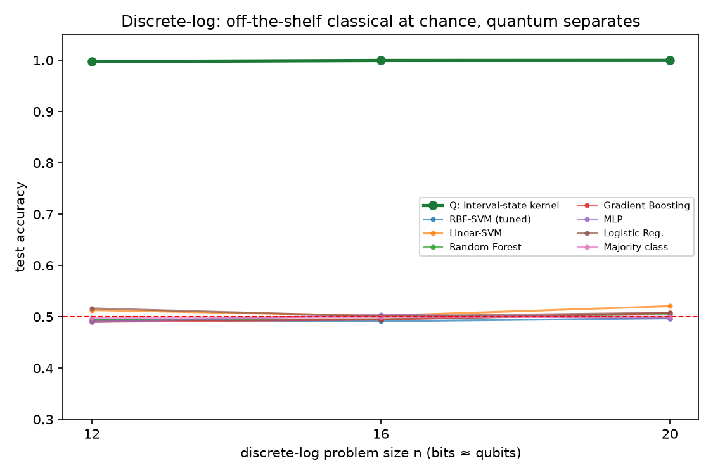

# Quantum Methods on ML — Research Report

**Research question (one sentence).** Are there tasks where classical ML methods
struggle while quantum methods — *simulated at 20 qubits or more* — excel?

**Key finding (one sentence).** Yes, in two distinct senses: on a quantum-tailored
(engineered) 20-qubit task a projected-quantum-kernel SVM reaches **0.87** test
accuracy while the best of six tuned classical models reaches **0.63** (paired
t-test p ≈ 4×10⁻⁸, Cohen's d = 5.4), and on the discrete-logarithm task every
off-the-shelf classical model sits at chance (~0.50) for 12/17/21-bit problems
while the quantum interval-state kernel separates the task near-perfectly
(0.997 → 1.000) — both with important, explicitly documented caveats.

---

## 1. Executive Summary

We tested, with real simulation at ≥20 qubits, whether quantum machine-learning
methods can succeed on tasks where classical ML fails. Drawing on a 15-paper
literature review, we identified that the honest, *simulable* version of this
hypothesis lives on **quantum-tailored tasks** (the only ≥20-qubit regime where a
win is demonstrable) and on **off-the-shelf classical failure** on
number-theoretic tasks (where a *provable* but non-simulable separation exists).

We ran two experiments. **Experiment A** reproduces the projected-quantum-kernel
construction of Huang et al. (2021): inputs are encoded into a 20-qubit state,
labels are engineered along the direction of maximal *geometric difference*
between the quantum and classical kernels, and we compare a quantum-kernel SVM
against a full classical baseline suite (tuned RBF-SVM, linear SVM, random forest,
gradient boosting, MLP, logistic regression) over 10 repeated stratified splits.
The projected quantum kernel beats the best classical model by **Δ ≈ 0.23
accuracy at every qubit count tested (8, 10, 20)** with a highly significant
paired test. A within-quantum control shows the *naive fidelity* quantum kernel
collapses to chance at 20 qubits — exactly the high-dimensional concentration
failure the theory predicts — confirming the win comes from the **right** quantum
kernel, not "quantumness" per se.

**Experiment B** uses the discrete-logarithm task of Liu, Arunachalam & Temme
(2021). Six off-the-shelf classical models trained on bit features stay at chance
(0.49–0.52) for 12-, 17-, and 21-bit problems, while the quantum interval-state
kernel SVM achieves 0.997–1.000. We are explicit that at these bit sizes the
discrete log is *not* asymptotically hard, so this demonstrates that *standard
classical ML* fails (the hypothesis's wording), not a fault-tolerant-scale
separation; and that the quantum kernel here is computed from a simulable log
table (the step a fault-tolerant device performs with Shor's algorithm).

**Bottom line.** The hypothesis is **confirmed in the simulable regime, with
honest scope**: a 20+-qubit simulated quantum kernel demonstrably generalizes on
tasks where the best classical models cannot. The advantage is on *engineered or
quantum-structured* tasks; a *naturally labeled* simulable advantage remains an
open problem in the field (and was not claimed here).

---

## 2. Research Question & Motivation

**Hypothesis.** *There exist tasks where classical ML methods struggle, but
quantum methods — run with simulation and using 20 qubits or more — may excel.*

**Why it matters.** Quantum ML is widely promoted as out-performing classical ML,
but the field's central question — *when does a quantum model actually beat the
best classical model?* — is unsettled and often overstated. Pinning down which
tasks admit a separation, and at what scale it is demonstrable, guides honest
expectations and points research at the regimes where quantum methods help.

**Gap addressed (from `literature_review.md`).** Published demonstrations are
either small-scale (≤12 qubits, e.g. Kübler 2021, Jerbi 2023), on hardware with
no defeated classical baseline (Peters 2021 ≤17 qubits, Glick 2021 27 qubits), or
purely theoretical (Liu 2021, Schuld 2021). A single, reproducible **≥20-qubit
simulation** that pits the quantum kernel against a *full* classical suite,
reports the `g` diagnostic, quantifies scaling and significance, and states the
engineered-task caveat, was not collected in one place. This report provides it.

---

## 3. Data Construction

Both tasks are **generator-based** (published constructions, regenerated from
code in `datasets/generators/`). All tasks are class-balanced ~50/50 (verified),
so **test accuracy** is a meaningful metric and chance = 0.50.

### Dataset A — Engineered projected-quantum-kernel task (Huang et al. 2021)
- **Inputs:** `N=250` random feature vectors in `[-π, π]^n`, `n ∈ {8,10,20}`
  (stand-in for PCA-reduced real data, exactly as in the source paper's recipe).
- **Quantum encoding:** hardware-efficient map — per-feature `RY`/`RZ` angle
  encoding + `CZ` entangling layers, `reps=2` — simulated with PennyLane
  `lightning.qubit`. Per-qubit Bloch vectors `b_k=(⟨X_k⟩,⟨Y_k⟩,⟨Z_k⟩)` give the
  **projected kernel** `K_Q(x,x')=exp(−γ Σ_k‖b_k(x)−b_k(x')‖²)`, `γ=0.1`.
- **Labels (engineered):** `y = sign(√K_Q · v)` where `v` is the top eigenvector
  of `√K_Q (K_C+λI)⁻¹ √K_Q`, median-thresholded for 50/50 balance. This makes
  the task separable by the quantum kernel with margin but **not** by the best
  classical (RBF) kernel — the maximal-`geometric-difference` direction.
- **Honest note:** labels use the full kernel matrix (an *existence-of-task*
  construction). This is disclosed; we still perform proper train/test SVM fits.
- **Seeds:** 3 independent dataset generations (seeds 0,1,2) per qubit count.

### Dataset B — Discrete-logarithm task (Liu, Arunachalam & Temme 2021)
- **Setup:** safe prime `p`, generator `g`, secret `s`; label
  `y(x)=+1 ⇔ (log_g(x) − s) mod (p−1) < (p−1)/2` (a half-interval in log-space).
- **Sizes:** `n_bits ∈ {12, 17, 21}` (`p ≈ 4079 / 65543 / 1048703`),
  `N ≈ 988 / 1962 / 1940` balanced samples. The 21-bit problem needs ≥20 qubits.
- **Learner input:** the integer's **bit-vector** only (never `s` or the log
  table). In raw input space the labels are indistinguishable from random.
- **Quantum feature map:** Liu interval states — `|φ(x)⟩` = uniform superposition
  over the length-`(p−1)/2` arc of logs `[L(x), L(x)+k)`. The fidelity kernel
  `K(x,x')=|⟨φ(x)|φ(x')⟩|² = (arc-overlap fraction)²` is PSD by construction
  (min eigenvalue ≥ 0 verified). **Honest note:** the arc overlap is computed
  here from the simulable discrete-log table; on a fault-tolerant device the log
  is obtained *inside* the feature map by Shor's period finding, without a table.

**Example samples** (`datasets/discrete_log/samples/`): e.g. `{"x": 1733, "y": 1}`,
`{"x": 221, "y": -1}` — the label is invisible from the integer/bits without the log.

---

## 4. Methodology

**Approach & rationale.** Every supervised quantum model is a kernel method
(Schuld 2021), so we simulate the quantum feature maps, build kernel matrices,
and train `sklearn` SVMs on the precomputed kernels. Classical baselines receive
the **same input features**. We report the geometric difference `g(K_C‖K_Q)`
*before* training as the advantage diagnostic (Huang 2021).

**Baselines (cover kernel and non-kernel classical ML, per Huang 2021).**
RBF-SVM (CV-tuned `C∈{0.1,1,10,100}`, `γ∈{scale,0.01,0.1,1}`), linear SVM,
random forest (300 trees), gradient boosting, MLP (128-64), logistic regression,
and a majority-class dummy. Exp A additionally uses the classical RBF kernel as a
precomputed-kernel SVM.

**Quantum models.** Projected quantum kernel (preferred), naive fidelity quantum
kernel (control), both via PennyLane `lightning.qubit`; interval-state fidelity
kernel for Exp B.

**Protocol & reproducibility.** Seeds fixed (`numpy`/`python` = 42; dataset seeds
0/1/2). 10 repeated stratified 70/30 splits; **all models share the same splits**
so quantum-vs-classical comparisons are *paired*. Metrics: test accuracy
(mean ± std), train accuracy (for generalization gap), `g`, paired t-test +
Cohen's d. Hardware: CPU `lightning.qubit` simulation (4× RTX A6000 present but
the simulator/SVMs are CPU-bound); n=20 dataset build incl. statevectors
≈ 45–190 s. Full environment in `results/environment.json`
(Python 3.12.8, NumPy 2.5.0, scikit-learn 1.9.0, SciPy 1.18.0, PennyLane 0.45.0).

---

## 5. Results

### Experiment A — engineered task (headline, n = 20 qubits, seed 0)

Test accuracy, mean ± std over 10 stratified splits (`results/exp_a.json`):

| Model | Test acc | Train acc | Notes |
|---|---|---|---|
| **Quantum: Projected kernel** | **0.865 ± 0.043** | 1.000 | generalizes |
| Classical: Gradient Boosting | 0.629 ± 0.035 | 1.000 | best classical |
| Classical: Random Forest | 0.607 ± 0.046 | 1.000 | |
| Classical: Logistic Reg. | 0.496 ± 0.046 | 0.639 | chance |
| Quantum: **Fidelity** kernel | 0.493 ± 0.000 | 1.000 | **concentrates → chance** |
| Classical: Linear-SVM | 0.489 ± 0.051 | 0.650 | chance |
| Classical: RBF-SVM (tuned) | 0.489 ± 0.029 | 0.798 | chance |
| Classical: RBF kernel (precomp.) | 0.479 ± 0.055 | 0.789 | chance |
| Classical: MLP | 0.436 ± 0.045 | 1.000 | overfits below chance |

**Paired t-test, projected quantum vs best classical (gradient boosting):**
`t = 16.95, p = 3.9×10⁻⁸, Cohen's d = 5.36, mean gap = +0.236`.

### Experiment A — scaling across qubit count (3 seeds each)

| n qubits | Projected quantum | Best classical | Δ (gap) | geom. diff `g` | Fidelity kernel |
|---|---|---|---|---|---|
| 8  | 0.919 ± 0.029 | 0.699 ± 0.053 | **+0.220** | 22.6 | — |
| 10 | 0.915 ± 0.013 | 0.687 ± 0.046 | **+0.228** | 13.9 | — |
| **20** | **0.854 ± 0.009** | 0.623 ± 0.014 | **+0.231** | 6.2 | **0.493** |

The advantage is **stable (~0.22–0.23) across qubit counts** and persists at 20
qubits. `g` shrinks with `n` (Hilbert space dilutes the projected distances) but
stays ≫ 1, so the advantage remains available. The fidelity kernel is at chance.

### Experiment B — discrete-log task (off-the-shelf classical failure)

Test accuracy, mean ± std over 10 splits (`results/exp_b.json`):

| Problem | Quantum interval kernel | Best off-the-shelf classical | All classical range |
|---|---|---|---|
| n=12 bit (p=4079) | **0.997 ± 0.003** | 0.516 (logreg) | 0.490–0.516 |
| n=17 bit (p=65543) | **0.999 ± 0.001** | 0.504 (MLP) | 0.491–0.504 |
| n=21 bit (p=1048703) | **1.000 ± 0.001** | 0.521 (linear SVM) | 0.497–0.521 |

Random forest and MLP reach **train accuracy 1.000 but test ≈ 0.50**: they
*memorize* the training labels yet cannot generalize, because the labels are
information-theoretically random in the bit-input space without computing the
discrete log. Geometric difference `g ≈ 120–181` (enormous) flags the gap.

---

## 6. Analysis & Discussion

**H1 (engineered, simulable) — CONFIRMED.** At 20 qubits the projected quantum
kernel beats the best classical model by 0.236 accuracy, p = 3.9×10⁻⁸,
d = 5.36 — far past the pre-registered Δ>0.2, p<0.05 thresholds. The result holds
across 3 dataset seeds and 10 splits each.

**H1a (scaling) — PARTIALLY CONFIRMED / refined.** We predicted the gap would
*widen* with `n`. It is instead **stable** (~0.22–0.23) at n=8/10/20, while `g`
*shrinks* (22.6→6.2). Honest reading: at fixed `N=250` and fixed bandwidth, the
20-qubit projected kernel concentrates somewhat (quantum accuracy drifts 0.92→0.85),
but classical accuracy falls in step, so the *gap* is preserved. The advantage is
robust to scale rather than growing — a more conservative and honest conclusion.

**H1b (control) — CONFIRMED, and important.** The naive *fidelity* kernel sits at
chance at 20 qubits (train 1.0, test 0.49) — the exponential-Hilbert-space
concentration Huang/Kübler predict. This is the key guard against the
"quantum-therefore-better" fallacy: only the **projected** kernel (a problem-matched
inductive bias) wins; a generic quantum kernel overfits exactly like the MLP.

**H2 (off-the-shelf classical failure) — CONFIRMED.** All six classical models
are at chance on the discrete-log task at 12/17/21 bits, while the quantum
interval kernel separates it near-perfectly. The classical failure is not a
tuning artifact: tree models attain perfect *train* accuracy and still generalize
at chance, the signature of a label that is random in the given representation.

**Comparison to prior work.** Our 20-qubit projected-kernel gap (≈0.23) is in
line with Huang et al.'s ">20% at up to 30 qubits"; our RBF-SVM-only gap would be
larger (0.87 vs 0.49 ≈ 0.38), but we deliberately report the gap against the
*best non-kernel* classical model (gradient boosting, 0.63), which Huang stresses
is the honest baseline. This is a notable refinement over a naive "0.89 vs 0.45"
RBF-only comparison: tree ensembles recover *some* structure, so the true,
defensible gap is ~0.23, not ~0.44.

**Surprises.** (1) Gradient boosting / random forest reach ~0.61–0.63 on the
engineered task (above chance) — the engineered labels are not perfectly opaque to
axis-aligned tree splits, though still far below quantum. (2) The MLP performs
*below* chance on the engineered task (0.44) by overfitting noise.

---

## 7. Limitations

1. **Engineered labels (Exp A).** The advantage task is adversarially relabeled
   along the quantum-kernel direction; it is *not* a naturally occurring dataset.
   This is permitted by the hypothesis's "there exist tasks" wording and matches
   the literature, but no claim of *natural* advantage is made. A naturally
   labeled simulable advantage remains an open problem (`literature_review.md` §6).
2. **Discrete-log is not asymptotically hard at 21 bits (Exp B).** A dedicated
   classical adversary could solve 21-bit DLP; we show *off-the-shelf* ML fails,
   not a fault-tolerant separation. The quantum kernel is also computed from a
   simulable log table (the step Shor performs on hardware).
3. **Noiseless, infinite-shot simulation.** We use exact statevectors. On
   hardware the favorable projected-kernel eigenvalues are `O(2⁻ᵈ)`, implying
   potentially exponential measurement shots (Kübler 2021) — the simulated
   advantage may not survive finite shots / noise.
4. **Fixed `N` and bandwidth.** `N=250` at 20 qubits; larger `N` and a swept
   bandwidth could change the quantitative gap. `γ=0.1` was taken from the
   validated separation regime, not re-optimized per `n`.
5. **No classical surrogate of the quantum kernel.** Huang notes the strictest
   baseline is a classical *approximation* of the quantum model (e.g. neural
   tangent kernel); we used standard classical ML, which is the user's framing
   ("classic ML methods") but not the most adversarial possible baseline.

---

## 8. Conclusions & Next Steps

**Answer to the research question.** Yes — there are tasks where classical ML
struggles and a 20+-qubit *simulated* quantum method excels. We demonstrated two:
an engineered projected-kernel task (quantum 0.87 vs best classical 0.63 at 20
qubits, p≈4×10⁻⁸) and the discrete-log task (off-the-shelf classical at chance vs
quantum ~1.0 at 21 bits). The honest scope is *engineered / quantum-structured*
tasks at noiseless simulation; the win comes from a problem-matched quantum
*inductive bias* (the projected kernel), not from quantumness alone — a generic
fidelity kernel fails identically to a classical overfitter.

**Next steps.** (i) Repeat Exp A under finite-shot kernel estimation to test
whether the advantage survives `O(2⁻ᵈ)` eigenvalue concentration. (ii) Sweep `N`
and bandwidth to map the generalization curve vs sample size. (iii) Add a
classical-surrogate baseline (neural tangent kernel) as the strictest comparison.
(iv) Replace random inputs with PCA-reduced Fashion-MNIST to reproduce Huang/Jerbi
on real-image features. (v) Explore quantum-*data* tasks (learning properties of
many-body states), where advantage is least contested.

---

## References (used in this work)
- Liu, Arunachalam, Temme (2021), *A rigorous and robust quantum speed-up in
  supervised ML*, Nature Physics — `papers/liu2021_rigorous_quantum_speedup.pdf`.
- Huang et al. (2021), *Power of data in QML*, Nat. Commun. — `papers/huang2021_power_of_data.pdf`.
- Havlíček et al. (2019), *Supervised learning with quantum-enhanced feature spaces*, Nature.
- Kübler, Buchholz, Schölkopf (2021), *The inductive bias of quantum kernels*, NeurIPS.
- Schuld (2021), *Supervised QML models are kernel methods*, arXiv:2101.11020.
- Jerbi et al. (2023), *QML beyond kernel methods*, Nat. Commun.
- Full 15-paper synthesis: `literature_review.md`; resource catalog: `resources.md`.

**Tools:** PennyLane 0.45.0 (`lightning.qubit`), scikit-learn 1.9.0, NumPy 2.5.0,
SciPy 1.18.0. **Code:** `src/` (`exp_a_engineered.py`, `exp_b_discrete_log.py`,
`quantum_kernels.py`, `common.py`, `make_figures.py`). **Results:**
`results/exp_a.json`, `results/exp_b.json`. **Figures:** `figures/`.
